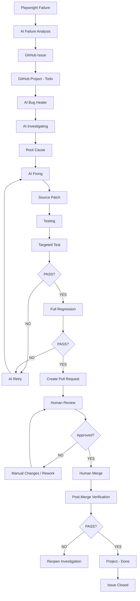

# AI Bug Healer

## Overview

The AI Bug Healer is an automated workflow that takes a bug from the GitHub Project dashboard and moves it through the complete bug-healing lifecycle:

```
Todo
  ↓
AI Investigating
  ↓
AI Fixing
  ↓
Testing
  ↓
Human Review
  ↓
Done
```

The GitHub Project dashboard is the **authoritative visual lifecycle** for the bug. The bug must NOT be moved to `Done` simply because:
- AI generated a patch
- A branch was created
- A Pull Request was created
- The targeted test passed
- The AI says the fix is correct

The bug can only move to `Done` after:
1. The source-code fix has been implemented
2. The targeted failing test passes
3. The full regression suite passes
4. The Pull Request has been reviewed
5. The Pull Request has been approved
6. The fix has been confirmed working
7. The Pull Request has been merged into the default branch
8. The GitHub Project item is then moved to `Done`

**The AI must never automatically merge the Pull Request. Human approval remains mandatory.**

---

## Architecture



---

## Trigger

The workflow is triggered manually via `workflow_dispatch`:

```yaml
workflow_dispatch:
  inputs:
    issue_number:
      description: "GitHub Issue number to heal"
      required: true
      type: string
```

Example:
```
Issue #123
```

The workflow identifies the corresponding GitHub Project item.

---

## Required Permissions

```yaml
permissions:
  contents: write
  issues: write
  pull-requests: write
  repository-projects: write
```

The AI does NOT receive permission to merge PRs automatically.

---

## Required Secrets

- `GEMINI_API_KEY` - Google Gemini API key for AI analysis
- `GITHUB_TOKEN` - Automatically provided by GitHub Actions

---

## Setup

### Prerequisites
- GitHub CLI (`gh`) installed and authenticated: `gh auth login`
- Repository admin/write access

### Quick Setup

Push all required variables and secrets in one command:

```bash
# Push AI Bug Healer variables (with safe defaults)
npm run gh-vars:push-ai-healer

# Push AI Bug Healer secrets (GEMINI_API_KEY from .env.local)
npm run gh-secrets:push-ai-healer
```

Or use the sync script directly:

```bash
# Push all variables
node scripts/sync-github-secrets.mjs push-ai-healer-vars

# Push all secrets
node scripts/sync-github-secrets.mjs push-ai-healer-secrets

# List current variables
node scripts/sync-github-secrets.mjs list-vars

# List current secrets
node scripts/sync-github-secrets.mjs list-secrets
```

### Required Variables

| Variable | Description | Default |
|----------|-------------|---------|
| `PROJECT_NAME` | GitHub Project name | `AI QA Bug Reporting` |
| `PROJECT_NUMBER` | GitHub Project number (set manually) | - |
| `AI_HEAL_MAX_ATTEMPTS` | Max AI fix attempts | `2` |
| `AI_HEAL_MAX_FILES` | Max files changed | `10` |
| `AI_HEAL_MAX_ADDED_LINES` | Max lines added | `300` |
| `AI_HEAL_MAX_DELETED_LINES` | Max lines deleted | `150` |
| `AI_HEAL_CONFIDENCE_THRESHOLD` | Min AI confidence (primary) | `0.70` |
| `AI_HEAL_CONFIDENCE_THRESHOLD_RETRY` | Min AI confidence (retry fallback) | `0.50` |
| `AI_HEAL_MAX_WAIT_MINUTES` | Max wait for human review | `60` |
| `AI_HEAL_POLL_INTERVAL` | Poll interval for PR review | `30` |
| `GEMINI_MODEL` | Gemini model to use | `gemini-3.6-flash` |

**Note:** `PROJECT_NAME` and `PROJECT_NUMBER` are not pushed automatically by the sync script. Set them manually in GitHub Settings → Variables → Repository. `PROJECT_NUMBER` can be found in your Project URL: `https://github.com/<owner>/<repo>/projects/<number>`.

### Required Secrets

| Secret | Description |
|--------|-------------|
| `GEMINI_API_KEY` | Google Gemini API key for AI analysis |
| `GITHUB_TOKEN` | Automatically provided by GitHub Actions |
| `PROJECT_PAT` | Optional: Personal access token with `repo` + `project` scopes for user-owned Projects |

---

## Required Configuration (Repository Variables)

| Variable | Description | Default |
|----------|-------------|---------|
| `PROJECT_NAME` | GitHub Project name | `AI QA Bug Reporting` |
| `PROJECT_NUMBER` | GitHub Project number (optional) | - |
| `AI_HEAL_MAX_ATTEMPTS` | Max AI fix attempts | `2` |
| `AI_HEAL_MAX_FILES` | Max files changed | `10` |
| `AI_HEAL_MAX_ADDED_LINES` | Max lines added | `300` |
| `AI_HEAL_MAX_DELETED_LINES` | Max lines deleted | `150` |
| `AI_HEAL_CONFIDENCE_THRESHOLD` | Min AI confidence | `0.70` |
| `AI_HEAL_CONFIDENCE_THRESHOLD_RETRY` | Retry confidence threshold (lower) | `0.50` |
| `AI_HEAL_MAX_WAIT_MINUTES` | Max wait for human review | `60` |
| `AI_HEAL_POLL_INTERVAL` | Poll interval for PR review | `30` |
| `GEMINI_MODEL` | Gemini model to use | `gemini-3.6-flash` |
| `DEFAULT_BRANCH` | Default branch name | `main` |

---

## Retry Behavior

When AI investigation confidence falls below `AI_HEAL_CONFIDENCE_THRESHOLD` (default 0.70), the workflow does **not** immediately skip downstream fix jobs. Instead, a `retry-ai-investigate` job re-runs the investigation with a lower threshold (`AI_HEAL_CONFIDENCE_THRESHOLD_RETRY`, default 0.50) and `ATTEMPT_NUMBER=2`.

- If the retry confidence meets the lower threshold: the pipeline continues through Apply AI Fix, validation, testing, and PR creation as normal.
- If the retry also fails to meet the lower threshold: the item moves to `AI Fix Failed` for manual review.
- If `AI_HEAL_MAX_ATTEMPTS` (default 2) is reached, the workflow moves to `AI Fix Failed`.

---

## Project Status Field

The workflow uses the existing GitHub Project's **Status** field (single-select). It discovers the field and its options dynamically - **never hard-codes option IDs**.

Required status options:
- `Todo`
- `AI Investigating`
- `AI Fixing`
- `Testing`
- `Human Review`
- `Done`
- `AI Fix Failed` (optional)

If the existing Project uses different names, the workflow adapts to the actual Project configuration.

---

## Job Lifecycle

### 1. Select Bug (`select-bug`)
- Validates issue number exists, is open, is a bug
- Retrieves issue details and Project item
- Checks current Project status is `Todo`
- Fails if status is `Done` or another healing is in progress

### 2. Move to AI Investigating (`update-project-investigating`)
- Updates Project status: `Todo → AI Investigating`
- Records transition in workflow log

### 3. Create Fix Branch (`create-fix-branch`)
- Creates branch: `fix/issue-<number>-<slug>`
- From latest `main` (or default branch)
- Never modifies default branch directly

### 4. AI Investigation (`ai-investigate`)
- AI analyses the issue, failing test, and application code
- Creates `root-cause.json` with:
  - Root cause description
  - Confidence score (0.0-1.0)
  - Affected files
  - Suggested fix
  - Test to validate
  - Reasoning
- If confidence < threshold (default 0.70), moves to `AI Fix Failed`

### 5. Move to AI Fixing (`update-project-fixing`)
- Updates Project status: `AI Investigating → AI Fixing`
- Only after credible root cause established

### 6. Apply AI Fix (`apply-ai-fix`)
- AI applies minimal, safe fix to source code
- Creates `git-diff.patch`
- Enforces limits: 10 files, 300 added, 150 deleted lines
- Forbidden: test modifications, weakened assertions, timeout increases, retries, etc.

### 7. Validate Patch (`validate-ai-patch`)
- Syntax check (TypeScript/JavaScript)
- Forbidden pattern detection
- Diff limit verification

### 8. Move to Testing (`update-project-testing`)
- Updates Project status: `AI Fixing → Testing`

### 9. Targeted Test (`targeted-test`)
- Runs the original failing test dynamically determined from:
  - `failure-data.json`
  - Issue body
  - Bug context
  - Root cause analysis
- If fails: moves back to `AI Fixing` (max 2 attempts)
- If both attempts fail: moves to `AI Fix Failed`

### 10. Full Regression (`full-regression`)
- Runs complete Playwright test suite
- If fails and related to AI change: retry (max 2 attempts)
- Otherwise: moves to `AI Fix Failed`

### 11. Create Pull Request (`create-pull-request`)
- Creates PR with `Fixes #<issue>` in description
- Includes: root cause, fix summary, files changed, test results, AI confidence, human review warning

### 12. Move to Human Review (`update-project-review`)
- Updates Project status: `Testing → Human Review`
- Indicates: AI fix passed automated validation, waiting for human review

### 13. Wait for Human Review (`wait-for-human-review`)
- Polls PR for approval (configurable timeout, default 60 min)
- If approved: proceeds
- If changes requested: stops, manual intervention required
- If timeout: PR remains open, status stays `Human Review`

### 14. Verify Merged Fix (`verify-merged-fix`)
- Verifies PR is merged
- Checks out default branch
- Runs full regression on merged code
- Ensures fix works in integrated codebase

### 15. Move to Done (`update-project-done`)
- **Only after ALL conditions met:**
  - Targeted test passed
  - Regression passed
  - PR approved
  - PR merged
  - Post-merge verification passed
- Updates Project status: `Human Review → Done`
- Uploads healing evidence (30-day retention)

---

## Evidence Retention

All healing evidence is uploaded as `ai-healing-evidence` artifact (30-day retention):

```
ai-healing-evidence/
├── bug-context.json
├── root-cause.json
├── ai-fix-summary.json
├── git-diff.patch
├── test-results/
└── project-status-transitions.json
```

This makes it possible to understand:
- What was the bug?
- What did AI think was wrong?
- What changed?
- What tests passed?
- Who approved the PR?
- When was it merged?
- When was the Project moved to Done?

---

## AI Fix Summary

The workflow generates `ai-fix-summary.json`:

```json
{
  "issueNumber": 123,
  "projectItemId": "...",
  "initialStatus": "Todo",
  "finalStatus": "Done",
  "branch": "fix/issue-123-api-event-availability",
  "attempt": 1,
  "maxAttempts": 2,
  "rootCause": "API handler accesses attendees before event payload normalization",
  "confidence": 0.94,
  "filesChanged": ["src/api/events.ts"],
  "linesAdded": 12,
  "linesDeleted": 4,
  "targetedTest": "Verify event availability",
  "targetedTestResult": "passed",
  "regressionResult": "passed",
  "pullRequest": 456,
  "pullRequestUrl": "...",
  "reviewStatus": "approved",
  "mergeStatus": "merged",
  "postMergeVerification": "passed",
  "projectCompletion": "Done"
}
```

---

## Failure States

Valid non-Done outcomes:
- `AI Investigating`
- `AI Fixing`
- `Testing`
- `Human Review`
- `AI Fix Failed`

The workflow **never** falsely moves an unresolved issue to `Done`.

---

## Example Complete Lifecycle

**Issue:** `#123` - API event availability returns undefined attendees

**Initial Project:** `Todo`

**User triggers:** `Run AI Bug Healer` with `Issue: 123`

**Workflow Execution:**
```
Todo
  ↓
AI Investigating
  ↓
AI discovers: API handler accesses attendees before event payload normalization
  ↓
AI Fixing
  ↓
AI modifies: src/api/events.ts
  ↓
Validation: Targeted test PASS
  ↓
Testing
  ↓
Full regression: PASS
  ↓
PR: #456 - fix: resolve issue #123
  ↓
Human Review
  ↓
Human reviews: APPROVED
  ↓
Human merges: PR #456 → main
  ↓
Post-merge: Playwright PASS
  ↓
Done
```

**Final State:**
- Issue #123 = Closed/Resolved
- Project = Done
- PR #456 = Merged

---

## Security Model

- Minimum permissions (contents, issues, PRs, projects write)
- No automatic merge permission
- Secrets never exposed or printed
- No secrets in generated files
- All AI operations use repository secrets

---

## Reusable Scripts

Located in `scripts/ai-healing/`:

| Script | Purpose |
|--------|---------|
| `fetch-issue.ts` | Fetch GitHub Issue details and create bug-context.json |
| `update-project-status.ts` | Update Project status field dynamically |
| `analyse-bug.ts` | AI investigation to find root cause |
| `apply-fix.ts` | AI applies minimal source code fix |
| `validate-patch.ts` | Validate patch (syntax, forbidden patterns, limits) |
| `run-targeted-test.ts` | Run the specific failing test |
| `create-pull-request.ts` | Create PR with full context |
| `verify-pr.ts` | Wait for human review/approval |
| `verify-merge.ts` | Verify PR merged and run post-merge tests |
| `verify-post-merge.ts` | Move Project to Done after all conditions met |
| `github-project.ts` | Shared Project utility (GraphQL operations) |

---

## Project Status Audit

Every transition is logged in `project-status-transitions.json`:

```json
[
  {"issueNumber": 123, "fromStatus": "Todo", "toStatus": "AI Investigating", "success": true, "timestamp": "2026-01-15T10:30:00Z"},
  {"issueNumber": 123, "fromStatus": "AI Investigating", "toStatus": "AI Fixing", "success": true, "timestamp": "2026-01-15T10:31:00Z"},
  {"issueNumber": 123, "fromStatus": "AI Fixing", "toStatus": "Testing", "success": true, "timestamp": "2026-01-15T10:35:00Z"},
  {"issueNumber": 123, "fromStatus": "Testing", "toStatus": "Human Review", "success": true, "timestamp": "2026-01-15T10:40:00Z"},
  {"issueNumber": 123, "fromStatus": "Human Review", "toStatus": "Done", "success": true, "timestamp": "2026-01-15T11:00:00Z"}
]
```

If a transition fails, it's clearly reported.

---

## Integration with Existing QA Pipeline

The AI Bug Healer **extends** the existing AI QA Bug Reporting pipeline:

- Reuses `PROJECT_NAME`, `PROJECT_NUMBER` configuration
- Reuses `github-project.ts` utility for Project operations
- Reuses existing Playwright test infrastructure
- Reuses existing CI architecture for regression testing
- Does NOT replace or duplicate the existing test pipeline

The existing workflow already:
- Runs Playwright tests
- Detects failures
- Generates `failure-data.json`
- Uses Gemini for AI analysis
- Creates GitHub Issues
- Adds to GitHub Project
- Generates Allure reports

The AI Bug Healer takes over from there for bugs already on the Project dashboard.

---

## Non-Negotiable Rules

1. **Done means genuinely complete** - not "AI generated fix", not "test passed", not "PR created"
2. **Human approval mandatory** - AI never merges
3. **Project is source of truth** - no independent status system
4. **No optimistic status updates** - only update after verification
5. **Dynamic Project field discovery** - never hard-code option IDs
6. **Patch limits enforced** - max 10 files, 300 added, 150 deleted
7. **Forbidden changes blocked** - no test deletion, weakening, timeout hacks
8. **Evidence retained** - 30 days for auditability
9. **Failure states visible** - never silently fail to Done

---

## Manual Trigger Instructions

1. Go to Actions → AI Bug Healer
2. Click "Run workflow"
3. Enter Issue number (e.g., `123`)
4. Click "Run workflow"

Monitor the workflow run for progress through each lifecycle stage.

---

## Troubleshooting

| Issue | Resolution |
|-------|------------|
| Project not found | Check `PROJECT_NAME` and `PROJECT_NUMBER` variables; ensure PAT has `project` scope |
| Status option not found | Verify Project has "Status" single-select field with required options |
| AI confidence too low | Retry investigation with lower threshold (`AI_HEAL_CONFIDENCE_THRESHOLD_RETRY`); if still below threshold, move to `AI Fix Failed` for manual review |
| Targeted test fails | AI will retry (max 2); check root-cause.json for analysis |
| PR not approved | Wait for human review; workflow polls for 60 min by default |
| Post-merge tests fail | Fix may have integration issues; investigate on default branch |
| Permission errors | Ensure GITHUB_TOKEN has required permissions; use PROJECT_PAT for user-owned Projects |